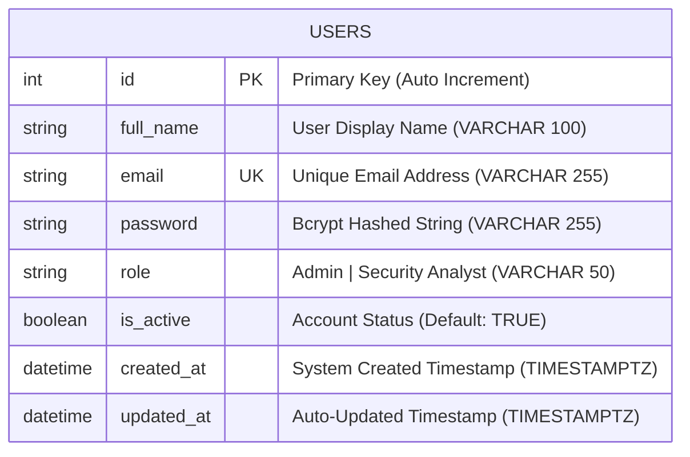

# ThreatLens AI - User Authentication System Architecture & ER Diagrams

This document contains publication-grade, clean visual diagrams, flowchart representations, Entity-Relationship (ER) models, and database schema specifications for the **User Management & Authentication Module**.

---

## 1. 🔄 Authentication System Flowchart (Architecture Data Flow)

```mermaid
graph TD
    %% Styling Nodes
    classDef client fill:#1E293B,stroke:#3B82F6,stroke-width:2px,color:#FFFFFF;
    classDef controller fill:#0F172A,stroke:#10B981,stroke-width:2px,color:#FFFFFF;
    classDef security fill:#451A03,stroke:#F59E0B,stroke-width:2px,color:#FFFFFF;
    classDef service fill:#172554,stroke:#6366F1,stroke-width:2px,color:#FFFFFF;
    classDef database fill:#022C22,stroke:#14B8A6,stroke-width:2px,color:#FFFFFF;

    subgraph Client_Layer ["🌐 Client & API Layer"]
        A[Client Request: Swagger / Postman] :::client
    end

    subgraph Controller_Layer ["⚡ FastAPI Controller Layer (auth_controller.py)"]
        B1["POST /auth/register"] :::controller
        B2["POST /auth/login"] :::controller
        B3["GET/PUT/DELETE /auth/profile"] :::controller
        B4["GET /auth/admin/dashboard"] :::controller
    end

    subgraph Security_Layer ["🛡️ Security & Authentication Middleware"]
        C1["OAuth2 Bearer Token Extraction"] :::security
        C2["Bcrypt Password Hashing & Verification"] :::security
        C3["JWT Token Sign & Decode (python-jose)"] :::security
        C4["Role-Based Access Control (RBAC Guard)"] :::security
    end

    subgraph Service_Layer ["⚙️ Business Logic Service (auth_service.py)"]
        D1["Email Uniqueness & Validation"] :::service
        D2["Credential Verification & Token Generation"] :::service
        D3["Profile Update & Deletion Logic"] :::service
    end

    subgraph Database_Layer ["🗄️ Database & Repository Layer"]
        E1["User Repository (user_repository.py)"] :::database
        E2["PostgreSQL / SQLAlchemy ORM (users table)"] :::database
    end

    %% Flow Connections
    A --> B1
    A --> B2
    A --> B3
    A --> B4

    B1 --> C2
    C2 --> D1
    D1 --> E1

    B2 --> C2
    C2 --> C3
    C3 --> D2

    B3 --> C1
    C1 --> D3
    D3 --> E1

    B4 --> C4
    C4 -->|Check Admin Role| D3

    E1 -->|Execute SQL| E2
```

---

## 2. 🛡️ Role-Based Access Control (RBAC) Flowchart

```mermaid
graph LR
    classDef admin fill:#7F1D1D,stroke:#EF4444,stroke-width:2px,color:#FFFFFF;
    classDef analyst fill:#1E3A8A,stroke:#3B82F6,stroke-width:2px,color:#FFFFFF;
    classDef perm fill:#064E3B,stroke:#10B981,stroke-width:2px,color:#FFFFFF;
    classDef block fill:#450A0A,stroke:#DC2626,stroke-width:2px,color:#FFFFFF;

    User["Authenticated User"]

    User -->|Role == Admin| AdminRole["Admin User"] :::admin
    User -->|Role == Security Analyst| AnalystRole["Security Analyst User"] :::analyst

    AdminRole -->|Access Granted| P1["View Profile"] :::perm
    AdminRole -->|Access Granted| P2["Update / Delete Account"] :::perm
    AdminRole -->|Access Granted| P3["Admin System Dashboard"] :::perm
    AdminRole -->|Access Granted| P4["Upload & Scan Malware"] :::perm

    AnalystRole -->|Access Granted| P1
    AnalystRole -->|Access Granted| P2
    AnalystRole -->|Access Granted| P4
    AnalystRole -->|Access Denied 403 Forbidden| P3 :::block
```

---

## 3. 🗄️ Database Entity-Relationship (ER) Model



---

## 4. 📦 Plain ASCII Architecture Diagram (For Presentation Slides & Reports)

```text
+---------------------------------------------------------------------------------------------------------+
|                                    CLIENT LAYER (Swagger UI / Postman)                                  |
+---------------------------------------------------------------------------------------------------------+
                                                     |
                                                     v
+---------------------------------------------------------------------------------------------------------+
|                               CONTROLLER LAYER (app/controllers/auth_controller.py)                     |
|  POST /auth/register   |   POST /auth/login   |   GET/PUT/DELETE /auth/profile   |   GET /auth/admin/...  |
+---------------------------------------------------------------------------------------------------------+
                                                     |
                                                     v
+---------------------------------------------------------------------------------------------------------+
|                              SECURITY & MIDDLEWARE LAYER (app/middleware/ & app/auth/)                 |
|  OAuth2 Bearer Token   |   Bcrypt Password Hashing   |   JWT Token Encoding/Decoding   |   RBAC Guard |
+---------------------------------------------------------------------------------------------------------+
                                                     |
                                                     v
+---------------------------------------------------------------------------------------------------------+
|                               SERVICE LAYER (app/services/auth_service.py)                              |
|  Email Duplication Check  |  Credential Verification  |  JWT Issuance  |  Profile Business Logic      |
+---------------------------------------------------------------------------------------------------------+
                                                     |
                                                     v
+---------------------------------------------------------------------------------------------------------+
|                               REPOSITORY LAYER (app/repositories/user_repository.py)                    |
|  create_user()   |   get_user_by_email()   |   get_user_by_id()   |   update_user()   |   delete_user()   |
+---------------------------------------------------------------------------------------------------------+
                                                     |
                                                     v
+---------------------------------------------------------------------------------------------------------+
|                              DATABASE LAYER (PostgreSQL / SQLAlchemy ORM)                               |
|                                         TABLE: users                                                    |
|  id (PK) | full_name | email (UK) | password (Bcrypt) | role | is_active | created_at | updated_at        |
+---------------------------------------------------------------------------------------------------------+
```

---

## 📑 Data Dictionary & Column Specifications

| Column Name | Data Type | Constraints | Description |
| :--- | :--- | :--- | :--- |
| `id` | `INTEGER` | `PRIMARY KEY`, `AUTO_INCREMENT` | Unique identifier for each user account. |
| `full_name` | `VARCHAR(100)` | `NOT NULL` | The full display name of the user. |
| `email` | `VARCHAR(255)` | `NOT NULL`, `UNIQUE`, `INDEX (idx_users_email)` | User's email address used as login identity. |
| `password` | `VARCHAR(255)` | `NOT NULL` | Bcrypt hashed password string (`$2b$...`). |
| `role` | `VARCHAR(50)` | `NOT NULL`, `CHECK (Admin / Security Analyst)` | User's authorization role for RBAC control. |
| `is_active` | `BOOLEAN` | `NOT NULL`, `DEFAULT TRUE` | Account status flag (enables soft-deletion / locking). |
| `created_at` | `TIMESTAMPTZ` | `DEFAULT CURRENT_TIMESTAMP` | System registration timestamp. |
| `updated_at` | `TIMESTAMPTZ` | `DEFAULT CURRENT_TIMESTAMP` | Automated trigger timestamp. |
