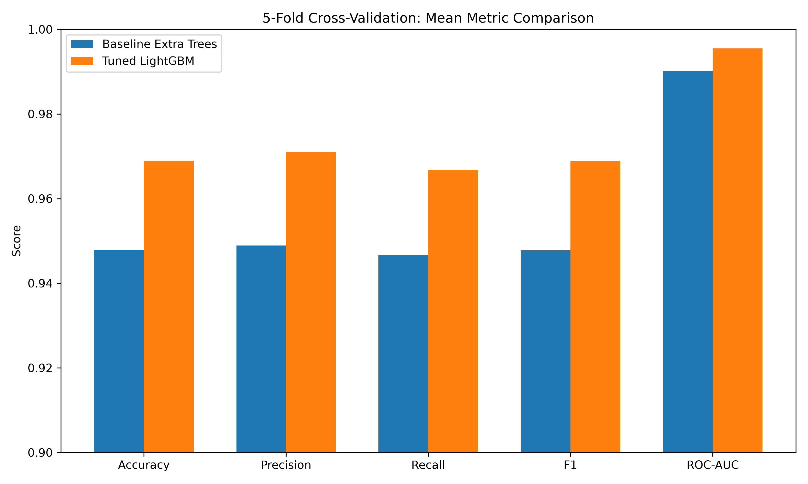
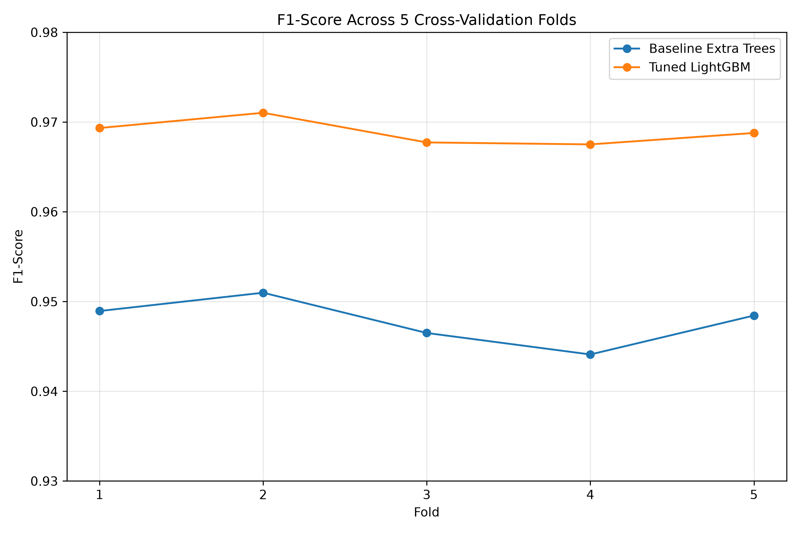

# 5-Fold Cross-Validation

## 1. Objective

5-fold cross-validation was performed to evaluate the consistency and reliability of the machine learning models.

The evaluation was performed on the 160,000 training samples only. The 40,000 test samples were kept completely untouched and were not used during cross-validation.

The following models were evaluated:

- Baseline Extra Trees
- Tuned LightGBM

The objective was to compare their performance across different subsets of the training data and identify the model with better and more consistent performance.

---

## 2. Cross-Validation Methodology

The 160,000 training samples were divided into 5 equal folds using Stratified K-Fold Cross-Validation.

Each fold contains approximately 32,000 samples.

For every iteration:

- 4 folds (128,000 samples) were used for training.
- 1 fold (32,000 samples) was used for validation.
- The process was repeated 5 times so that every fold was used once for validation.

The test dataset containing 40,000 samples was not used in this process.

### Fold Configuration

| Fold | Training Samples | Validation Samples |
|------|------------------:|-------------------:|
| Fold 1 | 128,000 | 32,000 |
| Fold 2 | 128,000 | 32,000 |
| Fold 3 | 128,000 | 32,000 |
| Fold 4 | 128,000 | 32,000 |
| Fold 5 | 128,000 | 32,000 |

Stratified K-Fold was used to maintain a similar class distribution across the folds.

---

## 3. Evaluation Metrics

The following metrics were calculated for every fold:

- Accuracy
- Precision
- Recall
- F1-Score
- ROC-AUC

Mean and standard deviation were then calculated across the five folds.

The mean represents the average performance of the model, while the standard deviation indicates how much the performance varies between folds.

---

## 4. Fold-wise Results

### Baseline Extra Trees

| Fold | Accuracy | Precision | Recall | F1 | ROC-AUC |
|-----:|---------:|----------:|-------:|----:|--------:|
| 1 | 0.9489 | 0.9483 | 0.9496 | 0.9489 | 0.9904 |
| 2 | 0.9510 | 0.9513 | 0.9506 | 0.9510 | 0.9909 |
| 3 | 0.9465 | 0.9471 | 0.9459 | 0.9465 | 0.9901 |
| 4 | 0.9443 | 0.9477 | 0.9406 | 0.9441 | 0.9890 |
| 5 | 0.9485 | 0.9501 | 0.9468 | 0.9484 | 0.9905 |

### Tuned LightGBM

| Fold | Accuracy | Precision | Recall | F1 | ROC-AUC |
|-----:|---------:|----------:|-------:|----:|--------:|
| 1 | 0.9694 | 0.9706 | 0.9681 | 0.9693 | 0.9957 |
| 2 | 0.9711 | 0.9721 | 0.9699 | 0.9710 | 0.9958 |
| 3 | 0.9678 | 0.9703 | 0.9651 | 0.9677 | 0.9956 |
| 4 | 0.9676 | 0.9710 | 0.9641 | 0.9675 | 0.9949 |
| 5 | 0.9688 | 0.9708 | 0.9668 | 0.9688 | 0.9954 |

---

## 5. Mean and Standard Deviation

| Model | Accuracy | Precision | Recall | F1 | ROC-AUC |
|-------|----------|-----------|--------|----|---------|
| Baseline Extra Trees | 0.9479 ± 0.0025 | 0.9489 ± 0.0018 | 0.9467 ± 0.0039 | 0.9478 ± 0.0026 | 0.9902 ± 0.0007 |
| Tuned LightGBM | **0.9689 ± 0.0014** | **0.9710 ± 0.0007** | **0.9668 ± 0.0023** | **0.9689 ± 0.0014** | **0.9955 ± 0.0004** |

---

## 6. Graphical Comparison

The cross-validation results were also visualized to make the performance difference between the two models easier to understand.

### Mean Metric Comparison

### F1-Score Across Folds

---

## 7. Results and Analysis

The cross-validation results show that Tuned LightGBM performed better than Baseline Extra Trees across all five evaluation metrics.

Tuned LightGBM achieved a mean accuracy of 96.89%, compared with 94.79% for Baseline Extra Trees.

The mean F1-score was 96.89% for Tuned LightGBM, while Baseline Extra Trees achieved 94.78%.

Tuned LightGBM also achieved a higher mean ROC-AUC of 99.55%, compared with 99.02% for Baseline Extra Trees.

The standard deviation values were low for both models, indicating that their performance remained relatively consistent across the five folds. Tuned LightGBM showed slightly lower variation for most metrics.

---

## 8. Conclusion

Based on the 5-fold cross-validation results, Tuned LightGBM is the better-performing model compared with Baseline Extra Trees.

It achieved higher Accuracy, Precision, Recall, F1-Score and ROC-AUC across the cross-validation experiment.

The results also show that Tuned LightGBM maintains consistent performance across different subsets of the training data.

Therefore, Tuned LightGBM is selected as the preferred model for further evaluation using the untouched test dataset.