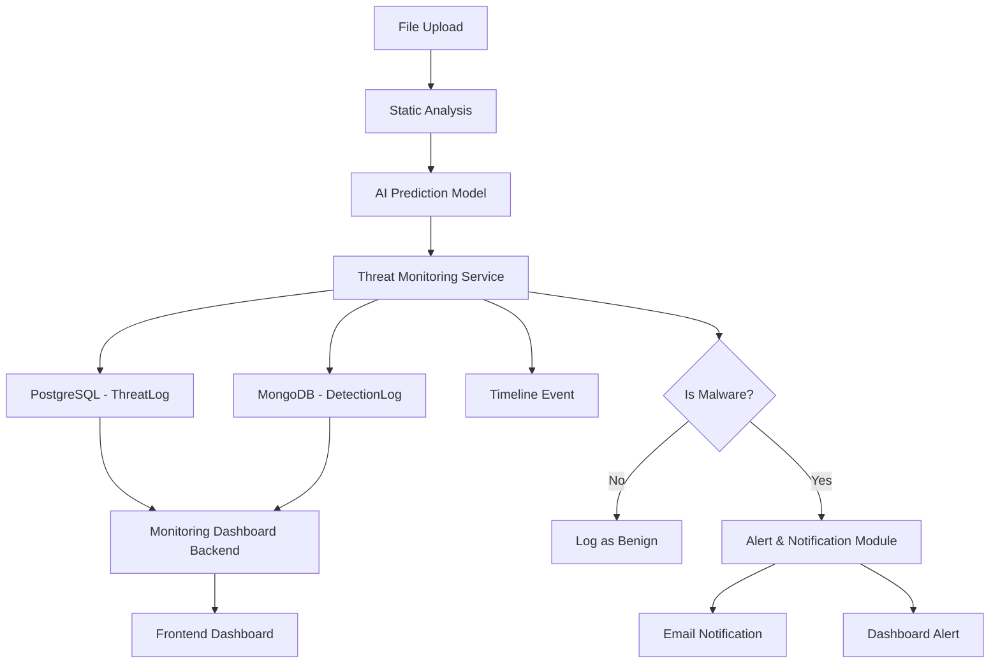

# Threat Monitoring Module — Implementation Plan

## Background

The ThreatLens AI project has existing code across several branches (primarily `origin/member-1-user-management-auth`). The codebase includes:

- **User Management & Auth** — FastAPI backend with JWT, RBAC, SQLAlchemy/PostgreSQL (with SQLite fallback)
- **File Upload API** — `/upload` endpoint accepting `.exe`, `.dll`, `.pdf`, `.doc`, `.docx`, `.zip`
- **Alert & Notification Module** — Full CRUD alert system with service-to-service ingest (`/api/v1/alerts/ingest`)
- **Frontend** — React + Vite + TypeScript + Tailwind CSS + Redux dashboard (uses mock data)
- **Stub references** — `Service.py` and `report.py` import from `threat_monitoring.models.ThreatLog` and `threat_monitoring.repository.ThreatRepository`, but these **don't exist yet**

The Threat Monitoring Module is the **missing core** that connects AI predictions to detection logs, history, reports, and the alert system.

---

## Scope — What We're Building

Per the user's request ("After the AI model predicts malware, build the monitoring system"):

| Deliverable | Description |
|---|---|
| **Detection Logs** | Store every file scan result (malware or benign) with metadata |
| **Threat History** | Query-able timeline of all detections |
| **Malware Tracking** | Track malware families, recurrence, status changes |
| **Threat Reports** | Generate summary reports (statistics, trends, per-family breakdown) |
| **Risk Score Storage** | Persist calculated risk scores alongside detections |
| **MongoDB Logging** | Dedicated MongoDB collection for high-volume detection event logs |
| **Threat Timeline** | Chronological event log per threat/detection |
| **Threat Monitoring APIs** | RESTful endpoints for all CRUD + query operations |
| **Monitoring Dashboard Backend** | Aggregation endpoints powering the frontend dashboard |

---

## Proposed Changes

### 1. Foundation — Restore Existing Code from Branch

Before building the new module, we need the existing codebase checked out and working.

#### Restore from `origin/member-1-user-management-auth`

- Checkout all existing backend, frontend, config, and database files from this branch onto `main`
- This gives us the working auth system, upload API, alert module, and frontend scaffold

---

### 2. Threat Monitoring Module — Backend Core

All files under `backend/app/modules/threat_monitoring/`

#### [NEW] `__init__.py`
- Package initialization, exports key classes

#### [NEW] `models.py` — SQLAlchemy + MongoDB Models
- `ThreatLog` (SQLAlchemy) — PostgreSQL table for structured threat data:
  - `id` (UUID, PK)
  - `filename`, `file_hash_md5`, `file_hash_sha256`
  - `file_size`, `file_type`
  - `prediction` (malware family: Trojan, Ransomware, Worm, etc.)
  - `confidence` (0-100 float)
  - `risk_score` (int), `risk_level` (enum: Critical/High/Medium/Low/Minimal)
  - `status` (enum: detected/quarantined/under_investigation/confirmed/resolved/false_positive)
  - `detection_engine` (string — which model/scanner detected it)
  - `yara_matches` (JSON array)
  - `static_analysis_results` (JSON)
  - `detected_at`, `updated_at`, `resolved_at` (timestamps)
  - `detected_by_user_id` (FK to users)
  - `notes` (text)
  
- `ThreatTimelineEvent` (SQLAlchemy) — Timeline entries per threat:
  - `id` (UUID, PK)
  - `threat_id` (FK to ThreatLog)
  - `event_type` (enum: detected/analyzed/escalated/status_changed/resolved)
  - `description` (text)
  - `created_at` (timestamp)
  - `created_by` (user reference)

- `MongoDetectionLog` (Pydantic model for MongoDB):
  - Full scan payload, raw analysis output, performance metrics
  - Used for high-volume audit logging that doesn't need relational queries

#### [NEW] `schemas.py` — Pydantic Request/Response Schemas
- `ThreatLogCreate` — input schema for recording a detection
- `ThreatLogResponse` — output schema with all computed fields
- `ThreatLogUpdate` — status updates, notes
- `ThreatTimelineResponse` — timeline event output
- `ThreatSummaryResponse` — dashboard statistics
- `ThreatReportResponse` — full report with breakdown
- `ThreatFilterParams` — query filter parameters (date range, severity, family, status)
- `PaginatedThreatResponse` — paginated list with total count

#### [NEW] `repository.py` — Data Access Layer (PostgreSQL)
- `ThreatRepository` class with methods:
  - `save_threat(threat)` — insert new detection
  - `get_all_threats(filters, pagination)` — filtered, paginated query
  - `get_threat_by_id(id)` — single threat detail
  - `get_threats_by_hash(hash)` — find recurrences
  - `update_threat_status(id, status)` — status transition
  - `total_files()`, `get_malware_count()`, `get_benign_count()`
  - `get_threats_by_family()` — group by malware family
  - `get_threats_by_severity()` — group by risk level
  - `get_threat_timeline(threat_id)` — timeline events
  - `add_timeline_event(threat_id, event)` — append to timeline
  - `get_detection_trend(days)` — daily detection counts for charts
  - `get_top_malware_families(limit)` — leaderboard
  - `delete_threat(id)` — admin delete

#### [NEW] `mongo_repository.py` — MongoDB Data Access
- `MongoThreatLogger` class:
  - `log_detection(event)` — insert detection event document
  - `get_logs(filters, limit)` — query detection logs
  - `get_log_by_id(id)` — single log
  - `get_logs_by_threat_id(threat_id)` — all logs for a threat
  - `get_detection_stats(time_range)` — aggregation pipeline for stats

#### [NEW] `mongo_connection.py` — MongoDB Connection Manager
- Motor (async MongoDB driver) connection setup
- Connection pooling, health check
- Falls back gracefully if MongoDB is unavailable (logs warning, continues with PostgreSQL only)

#### [NEW] `risk_score.py` — Enhanced Risk Score Calculator
- Move existing `calculate_risk_score()` here (from `backend/app/modules/risk_score.py`)
- Enhanced with multi-factor scoring:
  - Base score from AI confidence
  - Bonus for known dangerous families (Ransomware, Rootkit → +10)
  - Bonus for suspicious indicators (YARA matches, malicious URLs)
  - Returns `(score: int, level: str)` tuple

#### [NEW] `service.py` — Business Logic Layer
- `ThreatMonitoringService` class (replaces the stub in `Service.py`):
  - `record_detection(payload)` — orchestrates: calculate risk → save to PostgreSQL → log to MongoDB → create timeline event → trigger alert (via adapter) → return result
  - `get_threat_history(filters)` — paginated, filtered threat list
  - `get_threat_detail(id)` — single threat with timeline
  - `update_threat_status(id, status, user)` — status transition + timeline event
  - `get_dashboard_summary()` — aggregate stats for dashboard
  - `generate_threat_report(filters)` — comprehensive report generation
  - `get_threat_timeline(id)` — chronological events
  - `get_detection_trends(days)` — time-series data for charts
  - `get_malware_family_breakdown()` — pie chart data
  - `track_malware(hash)` — find all detections of same file
  - `resolve_threat(id, user)` — mark resolved + timeline

---

### 3. Threat Monitoring API Router

#### [NEW] `backend/app/api/threat_monitoring.py`
- RESTful API endpoints under `/api/v1/threats`:

| Method | Endpoint | Description | Access |
|---|---|---|---|
| `POST` | `/api/v1/threats/detect` | Record new detection (after AI prediction) | Analyst, Admin |
| `POST` | `/api/v1/threats/detect/internal` | Service-to-service detection ingest | API Key |
| `GET` | `/api/v1/threats` | List all threats (filtered, paginated) | All roles |
| `GET` | `/api/v1/threats/{id}` | Get threat details + timeline | All roles |
| `PATCH` | `/api/v1/threats/{id}/status` | Update threat status | Analyst, Admin |
| `PATCH` | `/api/v1/threats/{id}/resolve` | Resolve a threat | Analyst, Admin |
| `DELETE` | `/api/v1/threats/{id}` | Delete a threat | Admin only |
| `GET` | `/api/v1/threats/track/{hash}` | Track file across detections | All roles |
| `GET` | `/api/v1/threats/dashboard/summary` | Dashboard summary stats | All roles |
| `GET` | `/api/v1/threats/dashboard/trends` | Detection trends (time-series) | All roles |
| `GET` | `/api/v1/threats/dashboard/families` | Malware family breakdown | All roles |
| `GET` | `/api/v1/threats/reports/generate` | Generate threat report | Analyst, Admin |
| `GET` | `/api/v1/threats/timeline/{id}` | Get threat timeline | All roles |
| `GET` | `/api/v1/threats/logs` | MongoDB detection logs | All roles |
| `GET` | `/api/v1/threats/logs/{id}` | Single MongoDB log entry | All roles |

---

### 4. Database Schema Updates

#### [NEW] `database/schema/threat_monitoring.sql`
- `threat_logs` table with all columns, indexes, and constraints
- `threat_timeline_events` table
- Indexes on `file_hash_sha256`, `prediction`, `risk_level`, `status`, `detected_at`

---

### 5. Integration with Existing Modules

#### [MODIFY] `backend/app/main.py`
- Register the threat monitoring router
- Initialize MongoDB connection on startup
- Add CORS middleware for frontend

#### [MODIFY] `backend/app/modules/Service.py`
- Update imports to use the actual `threat_monitoring` package
- Wire into the alert adapter after saving detection

#### [NEW] `backend/app/modules/threat_monitoring/alert_integration.py`
- Bridge between threat monitoring and alert module
- On detection: if malware, build alert payload → call alert service

---

### 6. Configuration & Dependencies

#### [MODIFY] `.env.example`
- Add MongoDB URI (`MONGODB_URI`)
- Add threat monitoring config vars

#### [NEW] `backend/requirements.txt`
- FastAPI, uvicorn, SQLAlchemy, psycopg2-binary
- pymongo, motor (MongoDB async driver)
- python-jose, passlib, bcrypt (auth)
- pydantic, pydantic-settings
- python-multipart (file upload)

---

### 7. Test Suite

#### [NEW] `tests/backend_tests/test_threat_monitoring.py`
- Unit tests for:
  - Risk score calculation
  - Detection recording
  - Threat query filters
  - Status transitions
  - Timeline event generation
  - Dashboard aggregations
  - Report generation
  - MongoDB logging (mocked)

#### [NEW] `tests/backend_tests/test_threat_api.py`
- Integration tests for all API endpoints using FastAPI TestClient

---

### 8. Sample Data & Seeding

#### [NEW] `database/sample_data/sample_threats.py`
- Script to seed realistic threat data for development/demo
- Includes multiple malware families, varying risk scores, timeline events

---

## Architecture Flow



---

## Open Questions

> [!IMPORTANT]
> **MongoDB Setup**: The spec requires MongoDB logging. Do you have MongoDB installed locally, or should we use MongoDB Atlas (cloud-free tier)? If neither is available, we can implement a **graceful fallback** where MongoDB operations are logged to a local JSON file or SQLite instead.

> [!IMPORTANT]
> **PostgreSQL vs SQLite**: The existing code falls back to SQLite if PostgreSQL is unavailable. Should we keep this fallback behavior for threat monitoring as well? (Recommended: yes, for easier local development)

> [!NOTE]
> **AI Model Integration**: The current codebase has no actual ML model. The threat monitoring module will accept predictions via API — the actual model integration can be plugged in later. We'll create a **mock prediction endpoint** for testing that simulates AI output.

---

## Verification Plan

### Automated Tests
```bash
# Run all tests
python -m pytest tests/ -v

# Run threat monitoring tests only
python -m pytest tests/backend_tests/test_threat_monitoring.py -v
python -m pytest tests/backend_tests/test_threat_api.py -v
```

### Manual Verification
1. Start the backend server: `cd backend && uvicorn app.main:app --reload`
   (the package imports as `app.*`, so `uvicorn backend.app.main:app` from the
   repository root fails with `ModuleNotFoundError: No module named 'app'`)
2. Test all API endpoints via the auto-generated Swagger UI at `/docs`
3. Verify detection recording → alert creation flow
4. Verify dashboard summary aggregation endpoints
5. Verify MongoDB logging (if available) or fallback behavior
6. Run the seed script and verify data appears correctly in all endpoints
7. Test RBAC — verify role-based endpoint access control
